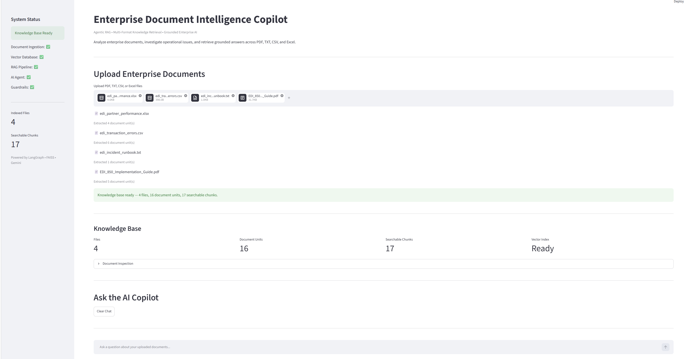
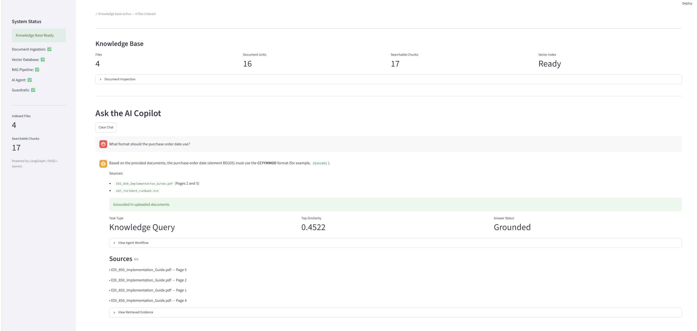
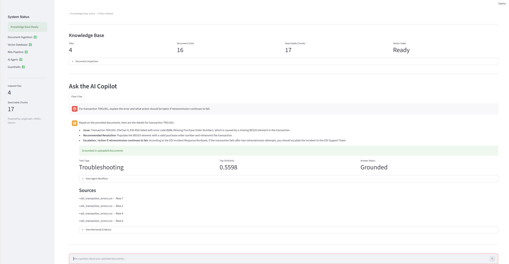
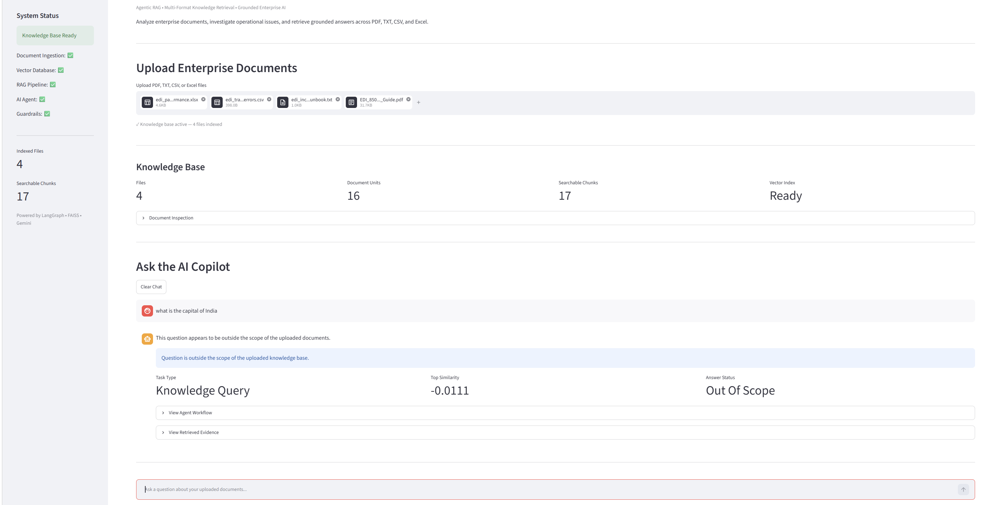

# Enterprise Document Intelligence Copilot

An Agentic RAG application for intelligent enterprise document analysis,
grounded question answering, and operational troubleshooting across
heterogeneous document formats.

The application ingests **PDF, TXT, CSV, and Excel documents**, converts
them into a unified semantic knowledge base, retrieves relevant evidence
using **Sentence Transformers + FAISS**, and orchestrates a **LangGraph
agent workflow** to generate grounded responses using **Google Gemini**.

Unlike a general-purpose chatbot, the system includes
retrieval-confidence guardrails that prevent unsupported or out-of-scope
questions from being answered using the LLM's general knowledge.

## Key Features

-   Multi-format enterprise document ingestion: PDF, TXT, CSV, XLSX
-   Semantic document chunking
-   Sentence Transformer embeddings
-   FAISS vector similarity search
-   Retrieval-Augmented Generation (RAG)
-   LangGraph-based agentic workflow
-   Google Gemini reasoning
-   Cross-document information retrieval
-   Source-aware grounded answers
-   Retrieval-confidence guardrails
-   Out-of-scope question detection
-   Insufficient-evidence handling
-   Multi-question Streamlit chat interface
-   Session-based vector-index caching
-   Document and chunk inspection
-   Agent workflow traceability
-   Automated test suite

## Architecture

``` text
                    Enterprise Documents
                PDF | TXT | CSV | XLSX
                          |
                          v
                Multi-Format Ingestion
                          |
                          v
                 Unified Document Model
                          |
                          v
                       Chunking
                          |
                          v
                Sentence Transformers
                          |
                          v
                    FAISS Vector DB
                          |
User Question ------------+
                          |
                          v
                   LangGraph Agent
                          |
                    +-----+------+
                    |            |
                    v            v
                 Planner      Retriever
                                  |
                                  v
                              Evidence
                                  |
                                  v
                              Reasoner
                               Gemini
                                  |
                                  v
                              Validator
                                  |
                 +----------------+----------------+
                 |                |                |
                 v                v                v
              Grounded       Insufficient      Out of
               Answer          Evidence         Scope
```

## Architecture Overview


## Agent Workflow

### 1. Planner

Analyzes the user's question and determines the task type, such as
knowledge query, troubleshooting, or comparison.

### 2. Retriever

Searches the FAISS vector index for semantically relevant document
chunks and retrieves multiple candidates to support single-document and
cross-document questions.

### 3. Reasoner

Relevant retrieved evidence is provided to Google Gemini to generate an
answer grounded in the uploaded enterprise documents.

### 4. Validator

Validates whether sufficient supporting evidence exists before returning
the response.

Possible response states: - **Grounded** - **Insufficient Evidence** -
**Out Of Scope**

Out-of-scope questions are blocked before unnecessary LLM generation.

## Example Cross-Document Reasoning

> For transaction TXN1001, explain the error and what action should be
> taken if retransmission continues to fail.

The system can combine transaction information from CSV data with error
definitions and escalation instructions from enterprise documentation
before generating a grounded response.

## Guardrails

For an unrelated question such as:

> What is the capital of India?

if the uploaded enterprise knowledge base does not contain sufficient
supporting evidence, the workflow returns **Out Of Scope** and skips LLM
generation.

## Technology Stack

  Layer                  Technology
  ---------------------- -----------------------
  Programming Language   Python
  User Interface         Streamlit
  LLM                    Google Gemini
  Agent Orchestration    LangGraph
  Embeddings             Sentence Transformers
  Vector Search          FAISS
  PDF Processing         PyMuPDF
  Tabular Processing     Pandas / OpenPyXL
  Testing                Pytest
  Configuration          python-dotenv

## Supported Document Formats

  Format   Processing
  -------- ---------------------------------------
  PDF      Page-level text extraction
  TXT      Text extraction
  CSV      Row-aware structured extraction
  XLSX     Sheet/row-aware structured extraction

Metadata such as page, row, sheet, source file, and file type is
preserved where applicable.

## Project Structure

``` text
enterprise-document-intelligence-copilot/
├── agents/
│   └── workflow.py
├── embeddings/
│   └── embedding_service.py
├── ingestion/
│   ├── chunker.py
│   ├── csv_loader.py
│   ├── document_processor.py
│   ├── excel_loader.py
│   ├── pdf_loader.py
│   └── txt_loader.py
├── models/
│   └── schemas.py
├── rag/
│   ├── answer_generator.py
│   ├── prompts.py
│   └── retrieval.py
├── vectorstore/
│   └── faiss_store.py
├── data/
│   └── sample_documents/
├── tests/
│   ├── test_agent_guardrails.py
│   ├── test_chunking.py
│   ├── test_imports.py
│   ├── test_ingestion.py
│   └── test_retrieval.py
├── app.py
├── requirements.txt
├── .env.example
├── .gitignore
└── README.md
```

## Installation

1.  Clone the repository:

``` bash
git clone <your-repository-url>
cd enterprise-document-intelligence-copilot
```

2.  Create and activate a virtual environment on Windows:

``` bash
python -m venv myenv
myenv\Scripts\activate
```

3.  Install dependencies:

``` bash
python -m pip install -r requirements.txt
```

4.  Create a `.env` file:

``` env
GEMINI_API_KEY=your_gemini_api_key
```

Never commit the `.env` file or API key to source control.

5.  Run the application:

``` bash
python -m streamlit run app.py
```

## Example Questions

-   **Knowledge Retrieval:** What format should the purchase order date
    use?
-   **Structured Data Retrieval:** Which Partner A transaction has error
    E101 and is still failed?
-   **Operational Troubleshooting:** When should an E101 incident be
    escalated?
-   **Cross-Document Reasoning:** For transaction TXN1001, explain the
    error and what action should be taken if retransmission continues to
    fail.
-   **Guardrail Test:** What is the capital of India?

The guardrail question should be classified as **Out Of Scope** rather
than answered using general LLM knowledge.

## Automated Testing

Run:

``` bash
python -m pytest -v
```

Current validated result:

``` text
21 passed
```

The tests cover module integrity, multi-format ingestion, chunking,
semantic retrieval, and agent routing/guardrails.

## Design Decisions

### Why FAISS?

Fast local vector similarity search without requiring an external vector
database.

### Why Sentence Transformers?

Local embeddings separate retrieval from generation and avoid
unnecessary LLM API calls during indexing.

### Why LangGraph?

Provides explicit orchestration of Planner, Retriever, Reasoner,
Validator, and guardrail routing instead of a single LLM call.

### Why retrieval guardrails?

The application evaluates retrieval confidence and can stop generation
when the uploaded knowledge base does not provide sufficient evidence.

## Current Scope and Future Enhancements

Current scope includes local semantic indexing, multi-format document
intelligence, grounded RAG, agentic orchestration, retrieval guardrails,
and explainable workflow traces.

Potential enhancements include persistent vector storage, hybrid search,
reranking, query decomposition, conversational context, authentication,
cloud storage, observability/evaluation metrics, and role-based document
access.

## Use Case

The included demonstration dataset uses enterprise EDI operations and
troubleshooting as an example domain. The architecture itself is
domain-independent and can be applied to technical documentation,
operational runbooks, incident knowledge bases, policies, procedures,
analytical documents, support documentation, and enterprise knowledge
management.

## Portfolio Skills Demonstrated

**Python • Generative AI • Agentic AI • RAG • LangGraph • Gemini •
Vector Search • FAISS • Semantic Retrieval • Streamlit • Automated
Testing**


## Application Demo

### Multi-Format Enterprise Document Intelligence

The application accepts PDF, TXT, CSV, and XLSX documents and builds a unified semantic knowledge base.



### Grounded RAG Response

Answers are generated using retrieved evidence from the uploaded enterprise documents.



### Cross-Document Troubleshooting

The agent can combine evidence retrieved from multiple enterprise sources to answer operational troubleshooting questions.



### Hallucination Guardrail

Questions that are not supported by the uploaded knowledge base are rejected rather than answered using Gemini's general knowledge.

